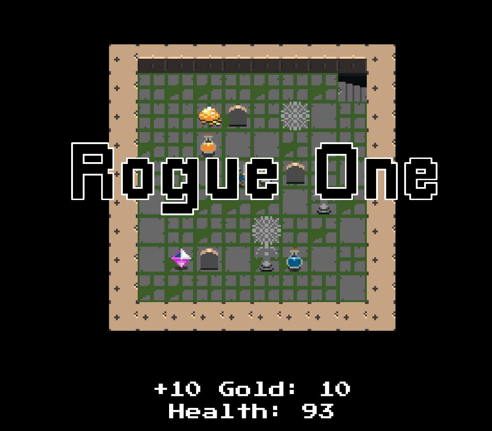
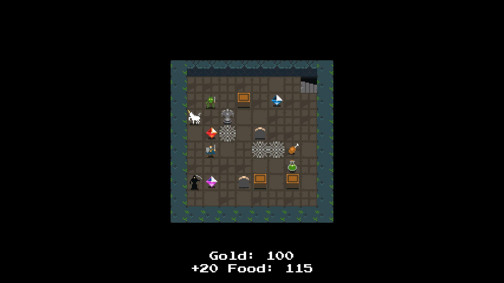
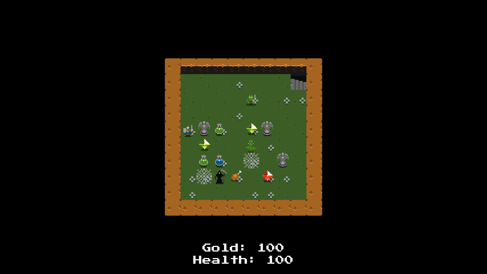

# RogueOne

A RogueLike 2D game with randomly generated dungeons. Try to climb the tower and escape. Which will you succumb to, the Monsters, or the Hunger?

## Play Now

Download the application for free on Windows from: https://dispixel.itch.io/rogueone

  
  
  

## Features

### Randomly Generated Levels

Each floor of the Tower has randomly generated environments from the Monsters and the Items to even the Walls and Floors.

### Infinite Playability

The Tower never ends. Challenge yourself to see how far you can get and how high you can score before your inevitable demise.

## Dependencies

This project uses the following paid assets:

- [Tiny Dungeon](https://oryxdesignlab.itch.io/tiny-dungeon)

© Nathan Foote | 2018
